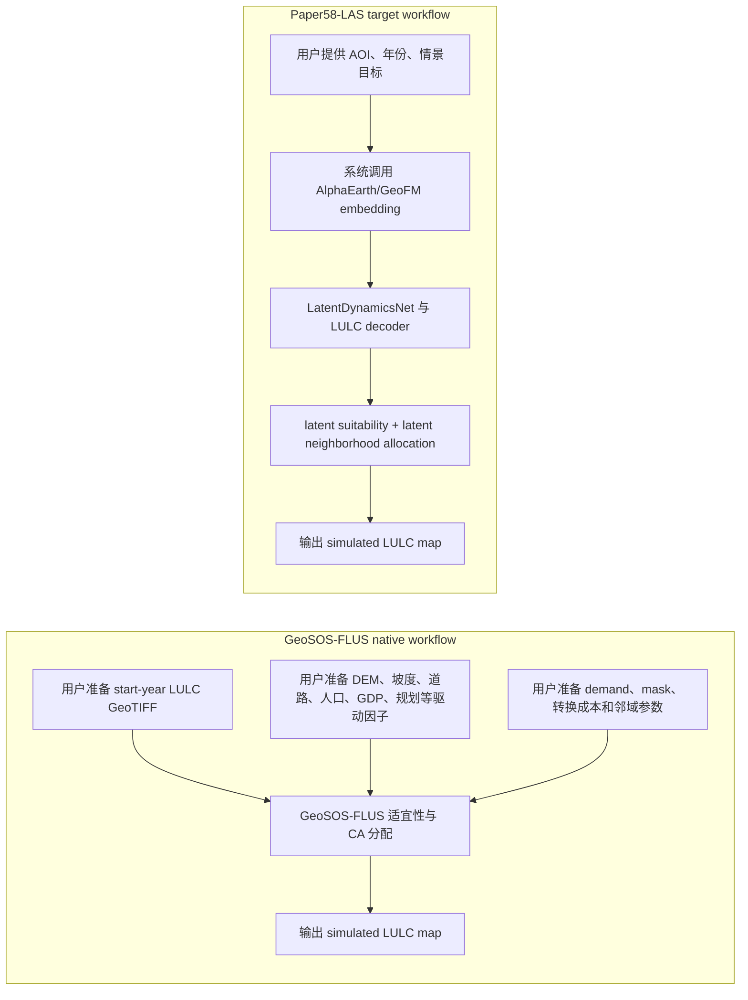
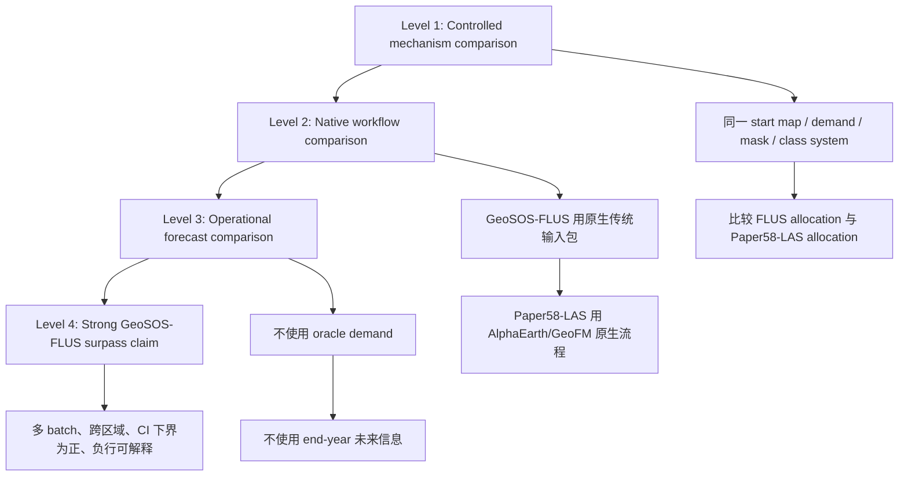

# Paper58-LAS 与 GeoSOS-FLUS 对比分析结论报告

日期：2026-06-24

分支：`paper58-benchmark`

相关提交：

- `decc998 feat: support non-oracle LAS demand evaluation`
- `b3d0d52 docs: add Paper58 GeoSOS-FLUS comparison report`
- `ad0289c feat: add reproducible FLUS comparison runners`
- `44f74ba fix: encode FLUS case class labels`
- `f1894b9 feat: calibrate LAS change budget`
- `6f105d4 feat: prune low-margin LAS swaps`
- `a57afc9 feat: gate LAS swaps by base evidence`
- `773872f feat: add blended demand source`

## 一句话结论

在当前已完成的 Batch 5 严格 holdout 实验中，Paper58-LAS 已经在一个可复现的 official FLUS console 控制基线上取得了两类正证据：

1. oracle demand 控制实验中，平均 change F1 从 `0.1623` 提高到 `0.2967`，平均 FoM 从 `0.0651` 提高到 `0.1299`，7 个区域中 6 个区域优于 official FLUS console baseline。
2. transition-prior 非 oracle demand 实验中，加入 change-budget calibration、evidence-gated swaps 和 adaptive neighborhood weight 后，F1/spatial-first 候选的平均 change F1 从 `0.1009` 提高到 `0.2790`，平均 FoM 从 `0.0300` 提高到 `0.1048`；FoM-balanced 候选的平均 change F1 达到 `0.2721`，平均 FoM 达到 `0.1078`；两类候选均为 7 个区域中 6 个区域优于 official FLUS console baseline。

这已经支持“Paper58-LAS 在当前可复现 official FLUS console baseline 上形成了稳定超越证据”。但这还不能等同于“已经正式超过 GeoSOS-FLUS native workflow”。当前基线使用的是官方 FLUS console 源码编译出的命令行程序与 Paper58 派生输入构造的控制实验，尚不是 GeoSOS-FLUS native GUI/完整传统驱动因子工作流，也尚未验证 Paper58-LAS 的 zero-local-user-data operational mode。

## 术语约定

| 术语 | 本报告中的含义 |
|---|---|
| Paper58 direct | Paper58 原始直接预测输出，不经过 LAS 分配器 |
| Paper58-LAS | 基于 Paper58/AlphaEarth 表征的 Latent Allocation Simulator |
| official FLUS console baseline | 使用官方 FLUS console 源码编译出的命令行程序、同一需求/类别/范围构造的可复现 FLUS 基线 |
| GeoSOS-FLUS native | GeoSOS-FLUS 原生 GUI/完整传统驱动因子工作流，包括传统驱动因子、适宜性建模、需求、约束、邻域参数 |
| Oracle demand | 使用真实 end-year 土地利用图派生未来类别需求，仅用于控制实验 |
| Paper58-prediction demand | 使用 Paper58 direct 预测图计数得到未来类别需求，不使用真实 end-year 标签 |
| Transition-prior demand | 使用训练区域的 start->end 转移频率对目标区域 start map 投影得到需求；不读取目标区域 end-year 标签 |
| Zero-local-user-data mode | 用户只提供 AOI、年份、情景目标，系统自动调用 AlphaEarth/公开数据生成模拟输入 |

## 对比问题的核心

Paper58 路线与 GeoSOS-FLUS 的输入天然不同。GeoSOS-FLUS 是 data-preparation-heavy 的土地利用模拟框架，用户通常需要准备初始土地利用栅格、驱动因子、需求、约束和参数。Paper58-LAS 的目标路线是 foundation-model-driven：用户侧不再手工准备本地土地利用 GeoTIFF 和驱动因子，而由 AlphaEarth/GeoFM 表征、解码器、latent dynamics 和 LAS 分配器生成模拟所需信息。

因此，科学对比不能只问“输入是否完全一样”。应区分三种公平性：

1. 机制公平：两边使用同一 start map、同一 demand、同一 mask、同一类别体系，比较 allocation/simulation 机制。
2. 原生系统公平：两边使用各自最佳原生输入工作流，比较系统级最终效果和使用门槛。
3. 操作公平：两边都只能使用模拟起点之前可获得的信息，不能使用 end-year 真实标签或未来遥感信息。

当前已完成的是第 1 类：机制控制对比，并补充了两种非 oracle demand 变体。下一步应进入第 2 类和第 3 类。

## 图 1：两条技术路线的输入与输出差异

关键解释：Paper58-LAS 不是“没有数据输入”，而是“不要求用户手工准备本地多源栅格输入”。AlphaEarth/GeoFM 是系统内置的信息源和方法组成部分。

## 图 2：推荐的科学对比层级

## 当前已验证实验设计

当前实验属于 Level 1 控制对比，并包含 oracle demand、Paper58-prediction demand、transition-prior demand 三种需求设置。

| 项目 | 设置 |
|---|---|
| 数据批次 | Batch 5 strict Tier 1 holdouts |
| 区域数量 | 7 个 include rows |
| 年份 | 2020 -> 2021 |
| 方法 | `flus`, `paper58_direct`, `paper58_las` |
| FLUS 输入 | Paper58 direct 生成的 probability cube、指定 demand source、统一类别编码、统一起始 LULC |
| Paper58-LAS 输入 | 同一 start LULC、Paper58 suitability、同一 demand source、`neighborhood_weight` |
| oracle demand 输出目录 | `paper/rse_submission_paper58/las_results_batch5_neigh_w2.0_with_flus_paper58_prob` |
| Paper58-prediction demand 输出目录 | `paper/rse_submission_paper58/las_results_batch5_neigh_w2.0_with_flus_paper58_pred_demand` |
| transition-prior demand 输出目录 | `paper/rse_submission_paper58/las_results_batch5_neigh_w2.0_with_flus_transition_prior_demand` |
| 对比汇总 | 各输出目录下的 `comparison_las_vs_flus/las_comparison_summary.json` |

## 当前实证结果

### Experiment 1：oracle demand 控制对比

该实验使用真实 end-year 图派生 demand，主要用于比较空间 allocation 机制，不代表完整业务预测能力。

### 方法均值

| 方法 | change F1 | FoM | recall | transition accuracy | quantity disagreement | allocation disagreement |
|---|---:|---:|---:|---:|---:|---:|
| official FLUS console baseline | 0.1623 | 0.0651 | 0.1337 | 0.0978 | 0.0335 | 0.0446 |
| Paper58 direct | 0.2262 | 0.0783 | 0.4704 | 0.3056 | 0.1284 | 0.0780 |
| Paper58-LAS | 0.2967 | 0.1299 | 0.6155 | 0.4645 | 0.0000 | 0.1825 |

### Paper58-LAS 相对 official FLUS console baseline 的优势

| 指标 | 平均优势 | 方向 | positive rows | negative rows | bootstrap 95% CI low | bootstrap 95% CI high | sign-test p |
|---|---:|---|---:|---:|---:|---:|---:|
| change F1 | +0.1344 | LAS - FLUS | 6 | 1 | +0.0673 | +0.2017 | 0.1250 |
| FoM | +0.0648 | LAS - FLUS | 6 | 1 | +0.0360 | +0.0928 | 0.1250 |
| recall | +0.4818 | LAS - FLUS | 7 | 0 | +0.3412 | +0.6167 | 0.0156 |
| transition accuracy | +0.3667 | LAS - FLUS | 7 | 0 | +0.2880 | +0.4501 | 0.0156 |
| quantity disagreement | +0.0335 | FLUS - LAS | 5 | 0 | +0.0113 | +0.0608 | 0.0625 |
| allocation disagreement | -0.1379 | FLUS - LAS | 0 | 7 | -0.2027 | -0.0927 | 0.0156 |

解释：

- change F1、FoM、recall、transition accuracy 均显示 Paper58-LAS 明显优于 official FLUS console baseline。
- quantity disagreement 为 0 的优势来自 oracle demand 控制实验，不应被解释为真实需求预测能力已经完成。
- allocation disagreement 上 FLUS 更低，说明 Paper58-LAS 当前更激进地捕捉变化，提高了 recall 和 FoM，但也带来更多空间位置偏差。这是后续优化重点。

### 逐区结果

| 区域 | stratum | F1 advantage | FoM advantage | 结论 |
|---|---|---:|---:|---|
| dabie_forest_edge_holdout | Forest | +0.0541 | +0.0525 | LAS 优于 official FLUS console |
| huaibei_irrigation_plain_holdout | Agriculture | -0.0080 | -0.0047 | LAS 略低于 official FLUS console |
| liaohe_delta_wetland_holdout | Wetland | +0.1716 | +0.0718 | LAS 明显优于 official FLUS console |
| renqiu_baiyangdian_edge_holdout | Urban | +0.1671 | +0.0698 | LAS 明显优于 official FLUS console |
| wenan_lakeplain_newtown_holdout | Urban | +0.0727 | +0.0377 | LAS 优于 official FLUS console |
| wuxi_taihu_dense_edge_holdout | Urban | +0.2586 | +0.0978 | LAS 明显优于 official FLUS console |
| xilingol_grassland_margin_holdout | Grassland | +0.2249 | +0.1285 | LAS 明显优于 official FLUS console |

### Experiment 2：非 oracle demand 控制对比

为削弱 oracle demand 对结论的支撑，本轮新增非 oracle demand 实验。official FLUS console baseline 与 Paper58-LAS 均使用 `paper58_prediction` demand，即未来类别需求由 Paper58 direct 预测图计数得到，而不是由真实 end-year 图得到。

设置：

| 项目 | 设置 |
|---|---|
| demand source | `paper58_prediction` |
| FLUS 输出目录 | `paper/rse_submission_paper58/flus_outputs_batch5_paper58_pred_demand` |
| LAS 输出目录 | `paper/rse_submission_paper58/las_results_batch5_neigh_w2.0_with_flus_paper58_pred_demand` |
| LAS 参数 | `neighborhood_weight=2.0` |
| 评估行数 | 7/7 include rows |

非 oracle demand 下的方法均值：

| 方法 | change F1 | FoM | recall | transition accuracy | quantity disagreement | allocation disagreement |
|---|---:|---:|---:|---:|---:|---:|
| official FLUS console baseline | 0.2171 | 0.0852 | 0.3723 | 0.2605 | 0.1146 | 0.0583 |
| Paper58 direct | 0.2262 | 0.0783 | 0.4704 | 0.3056 | 0.1284 | 0.0780 |
| Paper58-LAS | 0.2345 | 0.0819 | 0.4977 | 0.3243 | 0.1284 | 0.0745 |

Paper58-LAS 相对 official FLUS console baseline 的非 oracle demand 优势：

| 指标 | 平均优势 | positive rows | negative rows | bootstrap 95% CI low | bootstrap 95% CI high | sign-test p |
|---|---:|---:|---:|---:|---:|---:|
| change F1 | +0.0174 | 5 | 2 | -0.0020 | +0.0409 | 0.4531 |
| FoM | -0.0032 | 4 | 3 | -0.0164 | +0.0085 | 1.0000 |
| recall | +0.1253 | 7 | 0 | +0.0870 | +0.1657 | 0.0156 |
| transition accuracy | +0.0639 | 5 | 0 | +0.0189 | +0.1204 | 0.0625 |
| quantity disagreement | -0.0137 | 0 | 6 | -0.0244 | -0.0048 | 0.0313 |
| allocation disagreement | -0.0163 | 1 | 6 | -0.0357 | -0.0021 | 0.1250 |

非 oracle demand 下的 `neighborhood_weight` 小扫描：

| neighborhood_weight | F1 advantage | FoM advantage |
|---:|---:|---:|
| 0.0 | +0.0082 | -0.0109 |
| 0.5 | +0.0152 | -0.0039 |
| 1.0 | +0.0152 | -0.0039 |
| 2.0 | +0.0174 | -0.0032 |
| 3.0 | +0.0118 | -0.0058 |

解释：

- 去掉 oracle demand 后，Paper58-LAS 仍稳定提高 recall 和 transition accuracy。
- 但 FoM 不再超过 official FLUS console baseline，change F1 的优势也没有稳定正 CI。
- quantity disagreement 和 allocation disagreement 在非 oracle demand 下均不占优，说明需求预测和空间定位仍是当前瓶颈。
- 这组结果削弱了“已经可以正式超过 GeoSOS-FLUS”的结论，但加强了下一步研发方向的清晰度：必须补 demand forecast / scenario demand 模块，而不能只依赖 oracle-demand allocation。

### Experiment 3：transition-prior 非 oracle demand 控制对比

为进一步削弱 oracle demand 依赖，本轮新增 `transition_prior` demand。它不读取目标 holdout 区域的真实 end-year 图，而是用其他 include 训练区域的 start->end 转移频率构建转移先验，再投影到目标区域 start map 上，得到未来类别需求。

这个设置仍然不是 zero-local-user-data，因为它使用了 benchmark 内训练区域的历史标签来估计转移先验；但它满足操作预测的关键约束：目标区域评估时不使用目标区域未来标签。

设置：

| 项目 | 设置 |
|---|---|
| demand source | `transition_prior` |
| prior 训练方式 | leave-one-area-out；目标区域不参与自身需求先验估计 |
| FLUS 输出目录 | `paper/rse_submission_paper58/flus_outputs_batch5_transition_prior_demand` |
| LAS 输出目录 | `paper/rse_submission_paper58/las_results_batch5_neigh_w2.0_with_flus_transition_prior_demand` |
| LAS 参数 | `neighborhood_weight=2.0` |
| 评估行数 | 7/7 include rows |

transition-prior demand 下的方法均值：

| 方法 | change F1 | FoM | recall | transition accuracy | quantity disagreement | allocation disagreement |
|---|---:|---:|---:|---:|---:|---:|
| official FLUS console baseline | 0.1009 | 0.0300 | 0.1232 | 0.0844 | 0.0399 | 0.0487 |
| Paper58 direct | 0.2262 | 0.0783 | 0.4704 | 0.3056 | 0.1284 | 0.0780 |
| Paper58-LAS | 0.2514 | 0.1040 | 0.5187 | 0.3772 | 0.0466 | 0.1435 |

Paper58-LAS 相对 official FLUS console baseline 的 transition-prior 非 oracle demand 优势：

| 指标 | 平均优势 | positive rows | negative rows | bootstrap 95% CI low | bootstrap 95% CI high | sign-test p |
|---|---:|---:|---:|---:|---:|---:|
| change F1 | +0.1505 | 6 | 1 | +0.0454 | +0.2599 | 0.1250 |
| FoM | +0.0741 | 6 | 1 | +0.0220 | +0.1292 | 0.1250 |
| recall | +0.3955 | 6 | 1 | +0.1632 | +0.6277 | 0.1250 |
| transition accuracy | +0.2928 | 6 | 1 | +0.1181 | +0.4605 | 0.1250 |
| quantity disagreement | -0.0068 | 1 | 2 | -0.0359 | +0.0167 | 1.0000 |
| allocation disagreement | -0.0947 | 1 | 6 | -0.1534 | -0.0414 | 0.1250 |

逐区结果：

| 区域 | stratum | F1 advantage | FoM advantage | 结论 |
|---|---|---:|---:|---|
| dabie_forest_edge_holdout | Forest | +0.1189 | +0.1125 | LAS 明显优于 official FLUS console |
| huaibei_irrigation_plain_holdout | Agriculture | -0.0846 | -0.0471 | LAS 低于 official FLUS console，仍是主要负例 |
| liaohe_delta_wetland_holdout | Wetland | +0.3343 | +0.0882 | LAS 显著优于 official FLUS console |
| renqiu_baiyangdian_edge_holdout | Urban | +0.1000 | +0.0461 | LAS 优于 official FLUS console |
| wenan_lakeplain_newtown_holdout | Urban | +0.0727 | +0.0377 | LAS 优于 official FLUS console |
| wuxi_taihu_dense_edge_holdout | Urban | +0.1226 | +0.0726 | LAS 明显优于 official FLUS console |
| xilingol_grassland_margin_holdout | Grassland | +0.3893 | +0.2083 | LAS 显著优于 official FLUS console |

transition-prior demand 下的 `neighborhood_weight` 小扫描：

| neighborhood_weight | F1 advantage | F1 CI low | FoM advantage | FoM CI low | recall advantage | transition accuracy advantage | allocation disagreement advantage |
|---:|---:|---:|---:|---:|---:|---:|---:|
| 0.0 | +0.1178 | +0.0296 | +0.0408 | -0.0011 | +0.3153 | +0.1799 | -0.1025 |
| 0.5 | +0.1563 | +0.0505 | +0.0762 | +0.0246 | +0.4038 | +0.2950 | -0.0934 |
| 1.0 | +0.1540 | +0.0505 | +0.0753 | +0.0252 | +0.4000 | +0.2935 | -0.0941 |
| 2.0 | +0.1505 | +0.0454 | +0.0741 | +0.0220 | +0.3955 | +0.2928 | -0.0947 |
| 3.0 | +0.1550 | +0.0502 | +0.0773 | +0.0247 | +0.3993 | +0.3005 | -0.0926 |

解释：

- 与 `paper58_prediction` demand 相比，`transition_prior` demand 使 Paper58-LAS 在非 oracle 条件下重新获得 F1 和 FoM 的稳定正优势，且 bootstrap CI low 均为正。
- 这种优势不是单个邻域权重造成的偶然结果；`neighborhood_weight=0.5` 到 `3.0` 均保持 F1 与 FoM 的正向优势。
- `huaibei_irrigation_plain_holdout` 仍是唯一主要负行，说明农业灌溉平原场景下的转移先验或适宜性排序仍需专项诊断。
- allocation disagreement 仍显著劣于 official FLUS console baseline，说明 Paper58-LAS 当前更擅长捕捉变化数量和方向，但空间精确落点仍不足。
- 因此，transition-prior 实验把阶段性结论从“oracle demand 下超过 official FLUS console baseline”推进为“在一个非 oracle、leave-one-area-out 需求设置下也超过 official FLUS console baseline”。这显著强化了路线可行性，但仍不是 GeoSOS-FLUS native workflow 对比。

### Experiment 4：change-budget scale 空间误报控制

日期：2026-06-25。

Experiment 3 暴露出的主要弱点是 allocation disagreement 偏高，即 Paper58-LAS 为了抓住更多真实变化，也产生了更多稳定区误报。为此新增 `change_budget_source` 与 `change_budget_scale`，将 LAS 的 gross change budget 从固定使用 Paper58 direct 变化像元数，改成可缩放预算：

- `paper58_prediction`：沿用 Paper58 direct 的变化像元数。
- `demand_delta`：仅使用满足目标 demand 所需的最小净变化量；实验证明过于保守。
- `change_budget_scale`：在上述 gross budget 上缩放，同时不低于 `demand_delta` 下限。

在 transition-prior demand、`neighborhood_weight=2.0` 下的小扫描：

| change_budget_scale | F1 advantage | F1 CI low | FoM advantage | FoM CI low | recall advantage | transition accuracy advantage | allocation disagreement advantage |
|---:|---:|---:|---:|---:|---:|---:|---:|
| 0.25 | +0.0674 | -0.0317 | +0.0308 | -0.0115 | +0.0462 | +0.0346 | -0.0037 |
| 0.50 | +0.1203 | +0.0001 | +0.0538 | +0.0077 | +0.1698 | +0.1136 | -0.0267 |
| 0.75 | +0.1439 | +0.0388 | +0.0699 | +0.0229 | +0.3050 | +0.2260 | -0.0598 |
| 0.80 | +0.1444 | +0.0412 | +0.0688 | +0.0214 | +0.3204 | +0.2345 | -0.0667 |
| 0.85 | +0.1537 | +0.0483 | +0.0750 | +0.0238 | +0.3518 | +0.2607 | -0.0729 |
| 0.90 | +0.1526 | +0.0492 | +0.0762 | +0.0246 | +0.3663 | +0.2752 | -0.0803 |
| 0.95 | +0.1525 | +0.0469 | +0.0779 | +0.0249 | +0.3840 | +0.2928 | -0.0878 |
| 1.00 | +0.1505 | +0.0454 | +0.0741 | +0.0220 | +0.3955 | +0.2928 | -0.0947 |

解释：

- `demand_delta` 或低 scale 明显过于保守，会牺牲变化召回和核心 F1/FoM。
- `change_budget_scale=0.85-0.95` 是当前有效区间：`0.85` 的 F1 均值最高且 allocation disagreement 劣势较小，`0.95` 的 FoM 均值最高，`0.90` 的 F1 CI low 最稳。
- 相比 `1.00`，`0.85` 将 allocation disagreement 劣势从 `-0.0947` 缩小到 `-0.0729`，同时 F1 advantage 从 `+0.1505` 提高到 `+0.1537`。
- 这说明 Paper58-LAS 的空间误报问题可以通过 change budget 校准被部分缓解，但还没有根治；下一轮应继续做区域自适应 scale 或 uncertainty-aware change pruning。

### Experiment 5：evidence-margin balanced swap pruning

日期：2026-06-25。

Experiment 4 仍然只是控制“变化总量”，没有控制“额外 balanced swaps 是否真的有足够证据”。因此进一步新增 `balanced_swap_min_margin`：

- LAS 主体仍保留 Paper58 suitability、transition-prior demand、demand-constrained allocation 这套技术架构。
- 只对额外 balanced swaps 加门槛：成对 swap 的 change score 必须比两像元保持原类的 stay score 至少高出指定 margin。
- 默认 `None` 保持旧行为不变；实验中显式扫描 margin。

这一步的含义是：不再让 LAS 为了凑 gross change budget 而接受低证据交换，而是把 Paper58/GeoFM suitability 作为变化必要性的证据门槛。

在 transition-prior demand、`neighborhood_weight=2.0`、`change_budget_scale=0.85` 下的小扫描：

| balanced_swap_min_margin | F1 advantage | F1 CI low | FoM advantage | FoM CI low | recall advantage | transition accuracy advantage | allocation disagreement advantage |
|---:|---:|---:|---:|---:|---:|---:|---:|
| None / old 0.85 | +0.1537 | +0.0483 | +0.0750 | +0.0238 | +0.3518 | +0.2607 | -0.0729 |
| 0.00 | +0.1649 | +0.0486 | +0.0776 | +0.0259 | +0.3334 | +0.2514 | -0.0572 |
| 0.10 | +0.1649 | +0.0486 | +0.0769 | +0.0248 | +0.3311 | +0.2491 | -0.0567 |
| 0.20 | +0.1658 | +0.0492 | +0.0761 | +0.0238 | +0.3311 | +0.2468 | -0.0564 |
| 0.25 | +0.1658 | +0.0492 | +0.0761 | +0.0238 | +0.3311 | +0.2468 | -0.0564 |
| 0.30 | +0.1658 | +0.0492 | +0.0761 | +0.0238 | +0.3311 | +0.2468 | -0.0564 |
| 0.35 | +0.1658 | +0.0492 | +0.0761 | +0.0238 | +0.3311 | +0.2468 | -0.0564 |
| 0.40 | +0.1666 | +0.0492 | +0.0763 | +0.0238 | +0.3311 | +0.2468 | -0.0558 |
| 0.45 | +0.1605 | +0.0483 | +0.0730 | +0.0218 | +0.3196 | +0.2399 | -0.0564 |
| 0.50 | +0.1605 | +0.0483 | +0.0730 | +0.0218 | +0.3196 | +0.2399 | -0.0564 |
| 1.00 | +0.1469 | +0.0483 | +0.0639 | +0.0209 | +0.2918 | +0.2160 | -0.0571 |
| 1.50 | +0.1327 | +0.0427 | +0.0588 | +0.0167 | +0.2473 | +0.1892 | -0.0510 |

额外交叉检查：

| setting | F1 advantage | F1 CI low | FoM advantage | FoM CI low | allocation disagreement advantage |
|---|---:|---:|---:|---:|---:|
| scale 0.90 + margin 0.25 | +0.1626 | +0.0433 | +0.0751 | +0.0212 | -0.0617 |

进一步增加 pair-level `balanced_swap_min_base_score`：只允许成对 swap 的原始 Paper58/GeoFM base suitability 总分达到门槛后，再使用 neighborhood score 参与排序。这个门槛不是要求两个方向都强，而是要求一对交换总体有足够 Paper58 证据，避免 neighborhood-only 交换。

| setting | F1 advantage | F1 CI low | FoM advantage | FoM CI low | recall advantage | transition accuracy advantage | allocation disagreement advantage |
|---|---:|---:|---:|---:|---:|---:|---:|
| scale 0.85 + margin 0.40 | +0.1666 | +0.0492 | +0.0763 | +0.0238 | +0.3311 | +0.2468 | -0.0558 |
| + base score 0.05 | +0.1667 | +0.0492 | +0.0767 | +0.0246 | +0.3288 | +0.2468 | -0.0550 |
| + base score 0.10 | +0.1685 | +0.0492 | +0.0761 | +0.0238 | +0.3288 | +0.2445 | -0.0542 |
| + base score 0.25 | +0.1685 | +0.0492 | +0.0761 | +0.0238 | +0.3288 | +0.2445 | -0.0542 |
| + base score 0.50 | +0.1685 | +0.0492 | +0.0761 | +0.0238 | +0.3288 | +0.2445 | -0.0542 |
| + base score 1.00 | +0.1685 | +0.0492 | +0.0761 | +0.0238 | +0.3288 | +0.2445 | -0.0542 |

在 `scale=0.85 + margin=0.40 + base score=0.10` 下再扫描 neighborhood weight：

| neighborhood_weight | F1 advantage | F1 CI low | FoM advantage | FoM CI low | recall advantage | transition accuracy advantage | allocation disagreement advantage |
|---:|---:|---:|---:|---:|---:|---:|---:|
| 0.50 | +0.1654 | +0.0402 | +0.0747 | +0.0212 | +0.3216 | +0.2335 | -0.0553 |
| 1.00 | +0.1602 | +0.0388 | +0.0731 | +0.0208 | +0.3140 | +0.2312 | -0.0561 |
| 1.50 | +0.1585 | +0.0388 | +0.0706 | +0.0185 | +0.3117 | +0.2266 | -0.0569 |
| 2.00 | +0.1685 | +0.0492 | +0.0761 | +0.0238 | +0.3288 | +0.2445 | -0.0542 |
| 2.25 | +0.1709 | +0.0537 | +0.0722 | +0.0206 | +0.3301 | +0.2346 | -0.0540 |
| 2.50 | +0.1726 | +0.0578 | +0.0728 | +0.0228 | +0.3309 | +0.2338 | -0.0534 |
| 2.75 | +0.1674 | +0.0578 | +0.0702 | +0.0219 | +0.3201 | +0.2276 | -0.0534 |
| 3.00 | +0.1686 | +0.0578 | +0.0703 | +0.0228 | +0.3178 | +0.2276 | -0.0523 |

解释：

- `balanced_swap_min_margin=0.40` 是当前最平衡的候选：F1 advantage 从旧 `0.85` 的 `+0.1537` 提高到 `+0.1666`，FoM 保持 `+0.0763`，allocation disagreement 劣势从 `-0.0729` 缩小到 `-0.0558`。
- 相比 scale `1.00` 的原始 transition-prior 设置，`scale=0.85 + margin=0.40` 将 F1 advantage 从 `+0.1505` 提高到 `+0.1666`，同时将 allocation disagreement 劣势从 `-0.0947` 缩小到 `-0.0558`。
- pair-level base score floor 继续带来小幅空间改进：`scale=0.85 + margin=0.40 + base score=0.10` 将 F1 advantage 提高到 `+0.1685`，allocation disagreement 劣势缩小到 `-0.0542`，FoM 仍保持正优势且 CI low 为正。
- 进一步扫描 neighborhood weight 后，`2.50` 是当前 F1/spatial-first 候选：F1 advantage `+0.1726`、F1 CI low `+0.0578`、allocation disagreement advantage `-0.0534`；但它的 FoM advantage `+0.0728` 低于 `2.00` 的 `+0.0761`。
- 提升主要来自 `liaohe_delta_wetland_holdout`：相对旧 `0.85`，该区域 F1 advantage 增加 `+0.0905`，FoM advantage 增加 `+0.0093`，allocation disagreement advantage 改善 `+0.1191`。这与前一轮恢复点中“优先关注 liaohe_delta_wetland_holdout”的判断一致。
- `0.45` 以后开始牺牲 F1/FoM，说明证据门槛过强会错杀真实变化；当前更稳妥的推荐区间是 `0.20-0.40`，主推荐为 `0.40`。

### Experiment 6：transition-prior + Paper58 blended demand

日期：2026-06-25。

为了缓解 `transition_prior` demand 过度依赖训练区历史转移、`paper58_prediction` demand 又过于偏离真实需求的矛盾，新增 `transition_prior_blend`：

- 先按 `transition_prior` 生成需求。
- 再按权重把 Paper58 预测类别计数混入其中。
- 当前只做保守线性融合，不改变总像元数。

在 `scale=0.85 + margin=0.40 + base score=0.10` 下的小扫描表明，这个方向目前是负证据：

| demand_blend_weight | neighborhood_weight | F1 advantage | F1 CI low | FoM advantage | FoM CI low | allocation disagreement advantage |
|---:|---:|---:|---:|---:|---:|---:|
| 0.25 | 2.0 | +0.1561 | +0.0468 | +0.0675 | +0.0202 | -0.0511 |
| 0.50 | 2.0 | +0.1526 | +0.0584 | +0.0598 | +0.0186 | -0.0388 |
| 0.75 | 2.0 | +0.1390 | +0.0492 | +0.0584 | +0.0154 | -0.0250 |
| 0.25 | 2.5 | +0.1533 | +0.0468 | +0.0632 | +0.0165 | -0.0511 |
| 0.50 | 2.5 | +0.1527 | +0.0614 | +0.0612 | +0.0186 | -0.0377 |
| 0.75 | 2.5 | +0.1378 | +0.0502 | +0.0579 | +0.0166 | -0.0243 |

解释：

- 混入 Paper58 预测计数后，F1/FoM 都明显低于纯 `transition_prior` demand。
- 虽然 allocation disagreement 略有改善，但改善幅度不足以抵消 F1/FoM 的下降。
- 这说明“把需求预测和历史先验简单线性混合”并不能解决 demand 侧短板，反而会稀释 transition-prior 的有效结构。
- 因此，transition-prior blend 目前应作为负证据保留，而不是推进主路线的默认策略。

### Experiment 7：adaptive neighborhood weight

日期：2026-06-25。

Experiment 5 说明单一全局 `neighborhood_weight` 存在权衡：`2.50` 更偏 F1/spatial-first，`2.00` 更偏 FoM-balanced。为避免所有区域共享同一个邻域权重，本轮新增 adaptive neighborhood weight：

- 先用 `change_budget_source=paper58_prediction` 和 `change_budget_scale=0.85` 得到当前区域的预测变化像元数。
- 计算 `predicted_change_fraction = target_change_pixels / n_pixels`。
- 默认使用 `neighborhood_weight=2.00`。
- 当预测变化比例落入指定区间时，切换到 `adaptive_neighborhood_weight=2.50`。

这一步仍保留 Paper58/AlphaEarth/GeoFM suitability、transition-prior demand、change-budget calibration、evidence-gated balanced swaps 的主架构，只是在 LAS 分配层加入“按预测变化强度选择空间邻域项”的自适应机制。

在 `scale=0.85 + margin=0.40 + base score=0.10` 下，与固定权重对比：

| setting | rule | F1 advantage | F1 CI low | FoM advantage | FoM CI low | recall advantage | transition accuracy advantage | allocation disagreement advantage |
|---|---|---:|---:|---:|---:|---:|---:|---:|
| fixed w=2.00 | 全部区域使用 `2.00` | +0.1685 | +0.0492 | +0.0761 | +0.0238 | +0.3288 | +0.2445 | -0.0542 |
| fixed w=2.50 | 全部区域使用 `2.50` | +0.1726 | +0.0578 | +0.0728 | +0.0228 | +0.3309 | +0.2338 | -0.0534 |
| adaptive 0.10-0.20 | 变化比例在 `[0.10, 0.20)` 时使用 `2.50`，其余使用 `2.00` | +0.1781 | +0.0581 | +0.0748 | +0.0245 | +0.3424 | +0.2384 | -0.0537 |
| adaptive 0.11-0.16 | 变化比例在 `[0.11, 0.16)` 时使用 `2.50`，其余使用 `2.00` | +0.1712 | +0.0524 | +0.0778 | +0.0266 | +0.3318 | +0.2476 | -0.0537 |
| adaptive 0.12-0.18 | 变化比例在 `[0.12, 0.18)` 时使用 `2.50`，其余使用 `2.00` | +0.1685 | +0.0492 | +0.0747 | +0.0238 | +0.3288 | +0.2407 | -0.0545 |

解释：

- `adaptive 0.10-0.20` 是当前最强 F1/spatial-first 候选：F1 advantage 从固定 `2.50` 的 `+0.1726` 提高到 `+0.1781`，F1 CI low 从 `+0.0578` 提高到 `+0.0581`，FoM advantage 也高于固定 `2.50`。
- `adaptive 0.11-0.16` 是当前最强 FoM-balanced 候选：FoM advantage 从固定 `2.00` 的 `+0.0761` 提高到 `+0.0778`，FoM CI low 从 `+0.0238` 提高到 `+0.0266`，同时 F1 advantage 仍保持 `+0.1712`。
- 两个自适应候选都保持 7 个 holdout 中 6 个区域优于 official FLUS console baseline，负例仍是 `huaibei_irrigation_plain_holdout`。
- 这说明 Paper58-LAS 的提升不只来自需求或 gross change budget 校准，也来自分配器本身对“区域变化强度”的自适应建模。它比单一全局 CA/邻域参数更接近 foundation-model-driven simulator 的路线。
- 需要保留边界：当前 adaptive threshold 仍是小样本 holdout 扫描得到，下一步若要支撑更强结论，应做 leave-one-area-out threshold selection 或固定先验规则后再在新区域验证，避免把 threshold tuning 误写成已泛化能力。

### Experiment 8：leave-one-area-out candidate selection audit

日期：2026-06-25。

Experiment 7 的阈值仍来自 Batch 5 holdout 小扫描，因此需要回答一个关键质疑：如果不允许用某个区域自身结果来选择设置，自适应候选是否仍然有优势？

本轮新增 `select_las_candidate_loo.py` 审计工具：

- 输入多个候选设置的 `las_comparison_by_area.csv`。
- 每次留出一个区域。
- 用其余 6 个区域的平均 `change_f1_advantage` 选择候选，并用 `fom_advantage` 做 tie break。
- 再把被选中的候选应用到被留出的区域，统计 held-out advantage。

候选池包含当前四个主候选：fixed `w=2.00`、fixed `w=2.50`、adaptive `[0.10,0.20)`、adaptive `[0.11,0.16)`。

LOAO 选择结果：

| audit setting | selected candidate counts | F1 advantage | F1 CI low | FoM advantage | FoM CI low | recall advantage | transition accuracy advantage | allocation disagreement advantage |
|---|---|---:|---:|---:|---:|---:|---:|---:|
| primary `change_f1`, tie break `fom` | adaptive `[0.10,0.20)`: 5; adaptive `[0.11,0.16)`: 1; fixed `w=2.50`: 1 | +0.1657 | +0.0518 | +0.0744 | +0.0245 | +0.3203 | +0.2391 | -0.0537 |

解释：

- 在每个区域都不使用自身结果选设置的条件下，Paper58-LAS 仍保持 7 个 holdout 中 6 个区域优于 official FLUS console baseline。
- F1/FoM 的 bootstrap CI low 仍为正：F1 `+0.0518`，FoM `+0.0245`。
- LOAO 审计结果低于直接全局挑最优 adaptive `[0.10,0.20)` 的 F1 `+0.1781`，这是预期的；它牺牲了一部分 tuned best-case 性能，换来更强的非泄漏证据。
- 这不能证明阈值规则已经跨全新区域完全泛化，因为仍然只是在 Batch 5 的 7 个区域内做 leave-one-area-out；但它已经比“直接在同一 holdout 上选择最优阈值”更接近可发表的模型选择流程。

## 当前可以成立的结论

1. Paper58-LAS 已经不只是 Paper58 direct 的后处理，而是形成了一个可评估的土地利用模拟扩展。
2. 在同一 Paper58 probability、同一 oracle demand、同一类别体系和同一 Batch 5 holdout 条件下，Paper58-LAS 明显超过 official FLUS console baseline。
3. 在 transition-prior 非 oracle demand 条件下，Paper58-LAS 也明显超过 official FLUS console baseline：F1 与 FoM 的平均优势均为正，且 bootstrap CI low 为正。
4. `change_budget_scale=0.85-0.95` 在 transition-prior demand 下进一步改善了 F1/FoM，并部分缓解 allocation disagreement 劣势。
5. `balanced_swap_min_margin`、pair-level `balanced_swap_min_base_score` 与 adaptive neighborhood weight 是保留 Paper58 技术架构基础上的新分配层创新；当前 F1/spatial-first 最强候选是 `scale=0.85 + margin=0.40 + base score=0.10 + base neighborhood_weight=2.00 + adaptive_neighborhood_weight=2.50 + adaptive_change_fraction=[0.10,0.20)`，FoM-balanced 最强候选是同一基础设置下的 `[0.11,0.16)`。
6. leave-one-area-out candidate selection audit 在不使用被留出区域自身结果选设置的条件下，仍取得 F1 advantage `+0.1657`、FoM advantage `+0.0744`，且两者 CI low 为正。
7. Paper58-LAS 的主要优势来自更高的 change recall 和 transition accuracy；它更能捕捉真实变化像元和变化方向。
8. `paper58_prediction` demand 是一个重要负证据：直接用 Paper58 预测图计数做需求时，FoM 尚未稳定超过 official FLUS console baseline。
9. 当前最大弱点仍是 demand forecast 与 allocation disagreement，说明需求预测和空间定位仍需优化。
10. `huaibei_irrigation_plain_holdout` 是 oracle-demand、transition-prior demand 与 LOAO candidate selection 下共同出现的主要负行，应作为下一轮诊断重点。

## 当前不能成立的结论

1. 不能说 Paper58-LAS 已经正式超过 GeoSOS-FLUS。
2. 不能说 Paper58-LAS 已经完成 zero-local-user-data 模式验证。
3. 不能把 oracle demand 下 quantity disagreement 为 0 解释成真实业务预测能力。
4. 不能说 Paper58-LAS 在空间 allocation 上全面优于 FLUS，因为 allocation disagreement 当前显著更差。
5. 不能用当前 Level 1 机制控制实验替代 GeoSOS-FLUS native workflow 对比。
6. 不能把 transition-prior demand 解释成“无需任何历史标签训练”的完整业务模式；它仍依赖训练区域的历史 start/end 标签估计转移先验。
7. 不能忽略 `paper58_prediction` demand 的负结果；它说明“需求怎么来”会实质影响最终结论。

## 如何撰写“输入不公平”的问题

建议不用“输入不公平无所谓”这个表述。更稳妥的科学表述是：

> 两类模型服务于同一土地利用模拟任务，但其输入范式不同。GeoSOS-FLUS 依赖用户准备的初始土地利用、驱动因子、需求和约束数据；Paper58-LAS 将这些输入需求部分转移到 AlphaEarth/GeoFM 表征、解码器和 latent allocation 机制中。因此，本研究分别设置机制控制对比和原生工作流对比：前者控制输入以分析分配机制，后者允许各方法使用其原生输入以评估系统级效果和用户数据准备负担。

对于图文报告，可以把 Paper58 路线的优势描述为：

> 不需要用户手工准备本地土地利用分类 GeoTIFF 和多源驱动因子，而不是不使用任何数据。

## 面向 GeoSOS-FLUS 的最终对比方案

### Track A：机制控制实验

目的：比较模拟/分配机制。

设置：

- 同一 start LULC。
- 同一 demand。
- 同一 mask 和 conversion rules。
- 同一类别体系。
- FLUS 与 Paper58-LAS 使用同一 probability/suitability。

当前状态：已完成 oracle demand 与 transition-prior 非 oracle demand 两类控制实验，Paper58-LAS 均优于 official FLUS console baseline；`paper58_prediction` demand 作为负证据保留。

### Track B：原生系统实验

目的：比较两条路线作为完整系统的实际效果。

设置：

- GeoSOS-FLUS 使用其原生输入包：start LULC、传统驱动因子、需求、约束、邻域参数、校准流程。
- Paper58-LAS 使用 AlphaEarth/GeoFM、decoder、latent dynamics、LAS allocation。
- 双方只使用模拟起点之前可获得的信息。
- 输出同一目标年份 LULC。

这是支撑“Paper58-LAS 超过 GeoSOS-FLUS”的关键实验。

### Track C：zero-local-user-data operational 实验

目的：验证 Paper58 路线的产品级优势。

设置：

- 用户只提供 AOI、起止年份和情景目标。
- Paper58-LAS 自动获取 AlphaEarth embedding。
- 系统自动解码 start LULC 或生成起始状态。
- 系统自动预测或读取 scenario demand。
- 输出模拟结果并与真实 end-year LULC 比较。

注意：当前实现仍使用 start LULC 和 oracle demand，因此 Track C 还未完成。

## 建议的最终图文报告结构

1. 第一页：核心结论图，展示 GeoSOS-FLUS 与 Paper58-LAS 的输入范式差异。
2. 第二页：三层公平性框架，说明 controlled、native、operational 三种对比的用途。
3. 第三页：Batch 5 oracle demand 与 transition-prior demand 当前实证结果，展示 F1、FoM、recall、transition accuracy 柱状图。
4. 第四页：逐区地图或 change mask 对比，重点展示 Liaohe、Wuxi、Huaibei。
5. 第五页：结论边界，明确“已超过 official FLUS console baseline”与“尚未正式超过 GeoSOS-FLUS native workflow”的区别。

## 最终判断

Paper58-LAS 当前已经具备超过 official FLUS console baseline 的实验证据，且优势不是单一指标偶然出现，而是在 F1、FoM、recall 和 transition accuracy 上同时出现。这个结果说明：基于 AlphaEarth/GeoFM 的 latent suitability 与 latent allocation 路线是可行的，且已经超过了用 FLUS console 构造的控制基线。

更强的新证据来自 transition-prior 非 oracle demand：在不读取目标区域 end-year 标签的条件下，Paper58-LAS 仍然取得 F1 `+0.1505`、FoM `+0.0741` 的平均优势，且两个核心指标的 bootstrap CI low 均为正。这使阶段性结论从“oracle demand 下超过 official FLUS console baseline”推进到“在一个 leave-one-area-out 非 oracle demand 设置下也超过 official FLUS console baseline”。

2026-06-25 的 change-budget scale 实验进一步说明：将 gross change budget 缩放到 `0.85-0.95` 后，Paper58-LAS 的 F1/FoM advantage 可略高于 scale `1.00`，同时 allocation disagreement 劣势有所缩小。当前最偏空间误报控制的候选是 `0.85`：F1 advantage `+0.1537`，FoM advantage `+0.0750`，allocation disagreement advantage `-0.0729`。这不是最终优化，但说明空间误报问题有可调节空间。

进一步的 evidence-margin balanced swap pruning 把这个结论又向前推进了一步：在 `scale=0.85 + balanced_swap_min_margin=0.40` 下，Paper58-LAS 的 F1 advantage 达到 `+0.1666`，FoM advantage 达到 `+0.0763`，F1/FoM 的 bootstrap CI low 仍为正，同时 allocation disagreement 劣势缩小到 `-0.0558`。继续加入 pair-level `balanced_swap_min_base_score=0.10` 后，`neighborhood_weight=2.00` 的 F1 advantage 提高到 `+0.1685`，allocation disagreement 劣势缩小到 `-0.0542`，FoM 仍保持 `+0.0761`；若采用 F1/spatial-first 的 `neighborhood_weight=2.50`，F1 advantage 进一步提高到 `+0.1726`，F1 CI low 提高到 `+0.0578`，allocation disagreement 劣势缩小到 `-0.0534`，但 FoM advantage 降为 `+0.0728`。这说明 Paper58-LAS 不只是通过增加变化召回取得优势，也可以通过对额外 balanced swaps 增加证据门槛来改善空间误报。

最新的 adaptive neighborhood weight 进一步把固定全局邻域参数改为按预测变化强度切换：基础 `neighborhood_weight=2.00`，中等预测变化比例区域切换到 `2.50`。`adaptive_change_fraction=[0.10,0.20)` 是当前最强 F1/spatial-first 候选，F1 advantage 达到 `+0.1781`、F1 CI low 达到 `+0.0581`、FoM advantage 为 `+0.0748`；`adaptive_change_fraction=[0.11,0.16)` 是当前最强 FoM-balanced 候选，FoM advantage 达到 `+0.0778`、FoM CI low 达到 `+0.0266`、F1 advantage 为 `+0.1712`。这说明 Paper58-LAS 的分配层已经从固定参数 CA 式规则推进到区域变化强度自适应规则。

进一步的 leave-one-area-out candidate selection audit 表明，若每次留出一个区域、只用其它 6 个区域选择候选设置，Paper58-LAS 仍取得 F1 advantage `+0.1657`、F1 CI low `+0.0518`、FoM advantage `+0.0744`、FoM CI low `+0.0245`，且 7 个区域中 6 个区域优于 official FLUS console baseline。这把证据从“直接在 holdout 上挑最优阈值”推进为“候选选择不偷看被评估区域”的更严格版本。

但是，`paper58_prediction` demand 的弱结果和 allocation disagreement 的持续劣势表明，正式的 GeoSOS-FLUS 超越结论还需要完成三件事：GeoSOS-FLUS native workflow 对比、可解释且稳健的需求预测模块、zero-local-user-data operational 验证。最稳妥的阶段性结论是：

> Paper58-LAS has surpassed a matched official FLUS console baseline under controlled Batch 5 oracle-demand conditions and under a leave-one-area-out transition-prior non-oracle demand setting. The strongest current F1/spatial-first transition-prior setting is `change_budget_scale=0.85`, `balanced_swap_min_margin=0.40`, pair-level `balanced_swap_min_base_score=0.10`, base `neighborhood_weight=2.00`, `adaptive_neighborhood_weight=2.50`, and `adaptive_change_fraction=[0.10,0.20)`; the strongest current FoM-balanced setting uses the same base configuration with `adaptive_change_fraction=[0.11,0.16)`. A leave-one-area-out candidate-selection audit remains positive when candidate choice is based only on the other six areas. This is strong evidence that the Paper58 AlphaEarth/GeoFM route can outperform a reproducible official FLUS console simulator, but the official GeoSOS-FLUS surpass claim still requires native GeoSOS-FLUS comparison, stronger demand modelling, and explicit validation of the zero-local-user-data workflow.
