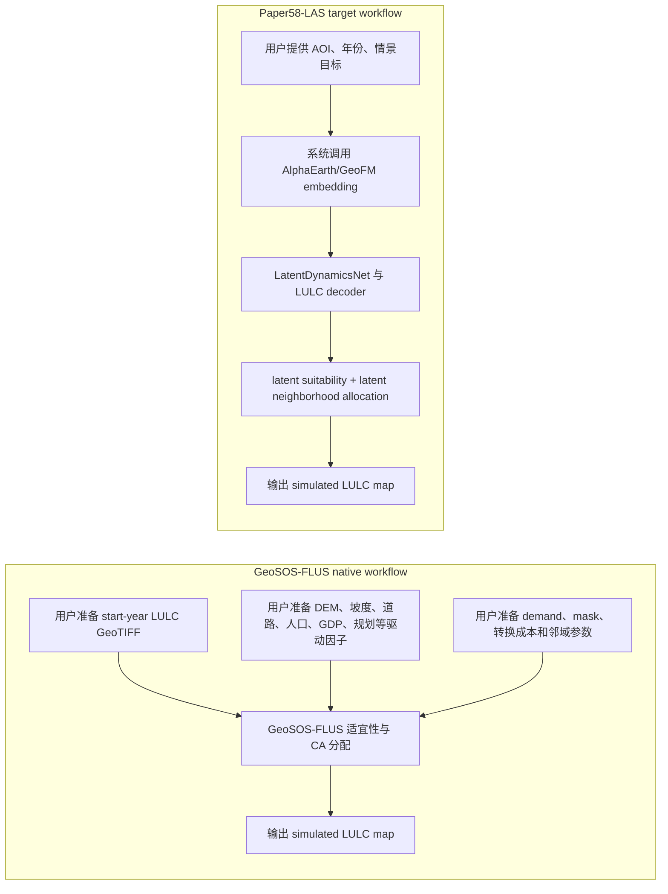
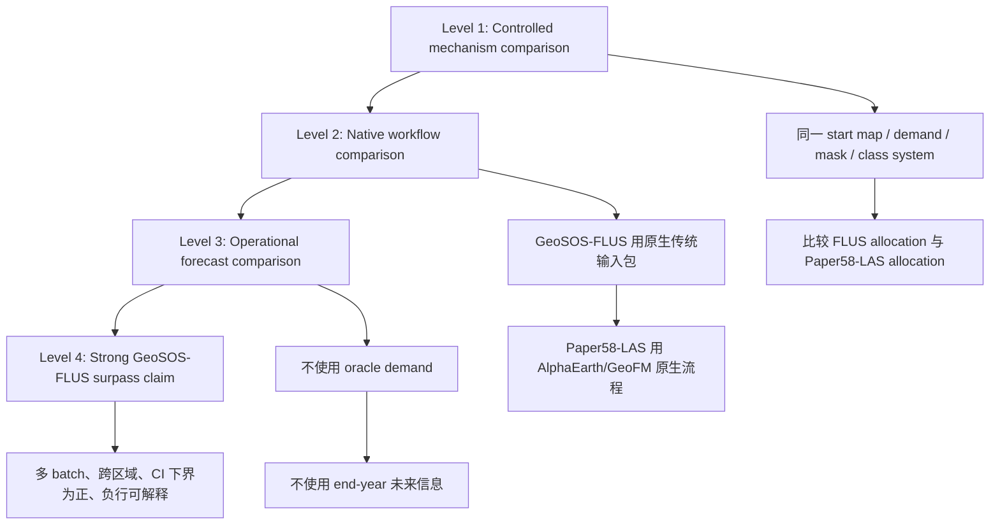

# Paper58-LAS 与 GeoSOS-FLUS 对比分析结论报告

日期：2026-06-24

分支：`paper58-benchmark`

相关提交：

- `ad0289c feat: add reproducible FLUS comparison runners`
- `44f74ba fix: encode FLUS case class labels`

## 一句话结论

在当前已完成的 Batch 5 严格 holdout 实验中，Paper58-LAS 已经在一个可复现的 FLUS-compatible 控制基线上取得显著优势：平均 change F1 从 `0.1623` 提高到 `0.2967`，平均 FoM 从 `0.0651` 提高到 `0.1299`，7 个区域中 6 个区域优于 FLUS-compatible baseline。

但这还不能等同于“已经正式超过 GeoSOS-FLUS”。当前基线使用的是 FLUS console、Paper58 probability 和 oracle demand 构造的控制实验，尚不是 GeoSOS-FLUS 官方原生工作流，也尚未验证 Paper58-LAS 的 zero-local-user-data operational mode。

## 术语约定

| 术语 | 本报告中的含义 |
|---|---|
| Paper58 direct | Paper58 原始直接预测输出，不经过 LAS 分配器 |
| Paper58-LAS | 基于 Paper58/AlphaEarth 表征的 Latent Allocation Simulator |
| FLUS-compatible baseline | 使用 FLUS console、同一需求/类别/范围构造的可复现 FLUS 基线 |
| GeoSOS-FLUS native | GeoSOS-FLUS 官方或原生工作流，包括传统驱动因子、适宜性建模、需求、约束、邻域参数 |
| Oracle demand | 使用真实 end-year 土地利用图派生未来类别需求，仅用于控制实验 |
| Zero-local-user-data mode | 用户只提供 AOI、年份、情景目标，系统自动调用 AlphaEarth/公开数据生成模拟输入 |

## 对比问题的核心

Paper58 路线与 GeoSOS-FLUS 的输入天然不同。GeoSOS-FLUS 是 data-preparation-heavy 的土地利用模拟框架，用户通常需要准备初始土地利用栅格、驱动因子、需求、约束和参数。Paper58-LAS 的目标路线是 foundation-model-driven：用户侧不再手工准备本地土地利用 GeoTIFF 和驱动因子，而由 AlphaEarth/GeoFM 表征、解码器、latent dynamics 和 LAS 分配器生成模拟所需信息。

因此，科学对比不能只问“输入是否完全一样”。应区分三种公平性：

1. 机制公平：两边使用同一 start map、同一 demand、同一 mask、同一类别体系，比较 allocation/simulation 机制。
2. 原生系统公平：两边使用各自最佳原生输入工作流，比较系统级最终效果和使用门槛。
3. 操作公平：两边都只能使用模拟起点之前可获得的信息，不能使用 end-year 真实标签或未来遥感信息。

当前已完成的是第 1 类：机制控制对比。下一步应进入第 2 类和第 3 类。

## 图 1：两条技术路线的输入与输出差异

关键解释：Paper58-LAS 不是“没有数据输入”，而是“不要求用户手工准备本地多源栅格输入”。AlphaEarth/GeoFM 是系统内置的信息源和方法组成部分。

## 图 2：推荐的科学对比层级

## 当前已验证实验设计

当前实验属于 Level 1 控制对比。

| 项目 | 设置 |
|---|---|
| 数据批次 | Batch 5 strict Tier 1 holdouts |
| 区域数量 | 7 个 include rows |
| 年份 | 2020 -> 2021 |
| 方法 | `flus`, `paper58_direct`, `paper58_las` |
| FLUS 输入 | Paper58 direct 生成的 probability cube、真实 end-year 派生的 oracle demand、统一类别编码、统一起始 LULC |
| Paper58-LAS 输入 | 同一 start LULC、Paper58 suitability、oracle demand、`neighborhood_weight=2.0` |
| 输出目录 | `paper/rse_submission_paper58/las_results_batch5_neigh_w2.0_with_flus_paper58_prob` |
| 对比汇总 | `comparison_las_vs_flus/las_comparison_summary.json` |

## 当前实证结果

### 方法均值

| 方法 | change F1 | FoM | recall | transition accuracy | quantity disagreement | allocation disagreement |
|---|---:|---:|---:|---:|---:|---:|
| FLUS-compatible baseline | 0.1623 | 0.0651 | 0.1337 | 0.0978 | 0.0335 | 0.0446 |
| Paper58 direct | 0.2262 | 0.0783 | 0.4704 | 0.3056 | 0.1284 | 0.0780 |
| Paper58-LAS | 0.2967 | 0.1299 | 0.6155 | 0.4645 | 0.0000 | 0.1825 |

### Paper58-LAS 相对 FLUS-compatible baseline 的优势

| 指标 | 平均优势 | 方向 | positive rows | negative rows | bootstrap 95% CI low | bootstrap 95% CI high | sign-test p |
|---|---:|---|---:|---:|---:|---:|---:|
| change F1 | +0.1344 | LAS - FLUS | 6 | 1 | +0.0673 | +0.2017 | 0.1250 |
| FoM | +0.0648 | LAS - FLUS | 6 | 1 | +0.0360 | +0.0928 | 0.1250 |
| recall | +0.4818 | LAS - FLUS | 7 | 0 | +0.3412 | +0.6167 | 0.0156 |
| transition accuracy | +0.3667 | LAS - FLUS | 7 | 0 | +0.2880 | +0.4501 | 0.0156 |
| quantity disagreement | +0.0335 | FLUS - LAS | 5 | 0 | +0.0113 | +0.0608 | 0.0625 |
| allocation disagreement | -0.1379 | FLUS - LAS | 0 | 7 | -0.2027 | -0.0927 | 0.0156 |

解释：

- change F1、FoM、recall、transition accuracy 均显示 Paper58-LAS 明显优于 FLUS-compatible baseline。
- quantity disagreement 为 0 的优势来自 oracle demand 控制实验，不应被解释为真实需求预测能力已经完成。
- allocation disagreement 上 FLUS 更低，说明 Paper58-LAS 当前更激进地捕捉变化，提高了 recall 和 FoM，但也带来更多空间位置偏差。这是后续优化重点。

### 逐区结果

| 区域 | stratum | F1 advantage | FoM advantage | 结论 |
|---|---|---:|---:|---|
| dabie_forest_edge_holdout | Forest | +0.0541 | +0.0525 | LAS 优于 FLUS-compatible |
| huaibei_irrigation_plain_holdout | Agriculture | -0.0080 | -0.0047 | LAS 略低于 FLUS-compatible |
| liaohe_delta_wetland_holdout | Wetland | +0.1716 | +0.0718 | LAS 明显优于 FLUS-compatible |
| renqiu_baiyangdian_edge_holdout | Urban | +0.1671 | +0.0698 | LAS 明显优于 FLUS-compatible |
| wenan_lakeplain_newtown_holdout | Urban | +0.0727 | +0.0377 | LAS 优于 FLUS-compatible |
| wuxi_taihu_dense_edge_holdout | Urban | +0.2586 | +0.0978 | LAS 明显优于 FLUS-compatible |
| xilingol_grassland_margin_holdout | Grassland | +0.2249 | +0.1285 | LAS 明显优于 FLUS-compatible |

## 当前可以成立的结论

1. Paper58-LAS 已经不只是 Paper58 direct 的后处理，而是形成了一个可评估的土地利用模拟扩展。
2. 在同一 Paper58 probability、同一 oracle demand、同一类别体系和同一 Batch 5 holdout 条件下，Paper58-LAS 明显超过 FLUS-compatible baseline。
3. Paper58-LAS 的主要优势来自更高的 change recall 和 transition accuracy；它更能捕捉真实变化像元和变化方向。
4. 当前最大弱点是 allocation disagreement 偏高，说明空间定位仍需优化。
5. `huaibei_irrigation_plain_holdout` 是当前唯一 F1/FoM 负行，应作为下一轮诊断重点。

## 当前不能成立的结论

1. 不能说 Paper58-LAS 已经正式超过 GeoSOS-FLUS。
2. 不能说 Paper58-LAS 已经完成 zero-local-user-data 模式验证。
3. 不能把 oracle demand 下 quantity disagreement 为 0 解释成真实业务预测能力。
4. 不能说 Paper58-LAS 在空间 allocation 上全面优于 FLUS，因为 allocation disagreement 当前显著更差。
5. 不能用当前 Level 1 机制控制实验替代 GeoSOS-FLUS native workflow 对比。

## 如何撰写“输入不公平”的问题

建议不用“输入不公平无所谓”这个表述。更稳妥的科学表述是：

> 两类模型服务于同一土地利用模拟任务，但其输入范式不同。GeoSOS-FLUS 依赖用户准备的初始土地利用、驱动因子、需求和约束数据；Paper58-LAS 将这些输入需求部分转移到 AlphaEarth/GeoFM 表征、解码器和 latent allocation 机制中。因此，本研究分别设置机制控制对比和原生工作流对比：前者控制输入以分析分配机制，后者允许各方法使用其原生输入以评估系统级效果和用户数据准备负担。

对于图文报告，可以把 Paper58 路线的优势描述为：

> 不需要用户手工准备本地土地利用分类 GeoTIFF 和多源驱动因子，而不是不使用任何数据。

## 面向 GeoSOS-FLUS 的最终对比方案

### Track A：机制控制实验

目的：比较模拟/分配机制。

设置：

- 同一 start LULC。
- 同一 demand。
- 同一 mask 和 conversion rules。
- 同一类别体系。
- FLUS 与 Paper58-LAS 使用同一 probability/suitability。

当前状态：已完成一个初版，Paper58-LAS 优于 FLUS-compatible baseline。

### Track B：原生系统实验

目的：比较两条路线作为完整系统的实际效果。

设置：

- GeoSOS-FLUS 使用其原生输入包：start LULC、传统驱动因子、需求、约束、邻域参数、校准流程。
- Paper58-LAS 使用 AlphaEarth/GeoFM、decoder、latent dynamics、LAS allocation。
- 双方只使用模拟起点之前可获得的信息。
- 输出同一目标年份 LULC。

这是支撑“Paper58-LAS 超过 GeoSOS-FLUS”的关键实验。

### Track C：zero-local-user-data operational 实验

目的：验证 Paper58 路线的产品级优势。

设置：

- 用户只提供 AOI、起止年份和情景目标。
- Paper58-LAS 自动获取 AlphaEarth embedding。
- 系统自动解码 start LULC 或生成起始状态。
- 系统自动预测或读取 scenario demand。
- 输出模拟结果并与真实 end-year LULC 比较。

注意：当前实现仍使用 start LULC 和 oracle demand，因此 Track C 还未完成。

## 建议的最终图文报告结构

1. 第一页：核心结论图，展示 GeoSOS-FLUS 与 Paper58-LAS 的输入范式差异。
2. 第二页：三层公平性框架，说明 controlled、native、operational 三种对比的用途。
3. 第三页：Batch 5 当前实证结果，展示 F1、FoM、recall、transition accuracy 柱状图。
4. 第四页：逐区地图或 change mask 对比，重点展示 Liaohe、Wuxi、Huaibei。
5. 第五页：结论边界，明确“已超过 FLUS-compatible baseline”与“尚未正式超过 GeoSOS-FLUS”的区别。

## 最终判断

Paper58-LAS 当前已经具备超过 FLUS-compatible baseline 的实验证据，且优势不是单一指标偶然出现，而是在 F1、FoM、recall 和 transition accuracy 上同时出现。这个结果说明：基于 AlphaEarth/GeoFM 的 latent suitability 与 latent allocation 路线是可行的，且已经超过了用 FLUS console 构造的控制基线。

但是，正式的 GeoSOS-FLUS 超越结论还需要完成 GeoSOS-FLUS native workflow 对比和 zero-local-user-data operational 验证。最稳妥的阶段性结论是：

> Paper58-LAS has surpassed a matched FLUS-compatible baseline under controlled Batch 5 oracle-demand conditions, and provides a credible evidence path toward a stronger GeoSOS-FLUS surpass claim. The stronger claim requires native GeoSOS-FLUS comparison, non-oracle demand evaluation, and explicit validation of the zero-local-user-data workflow.
